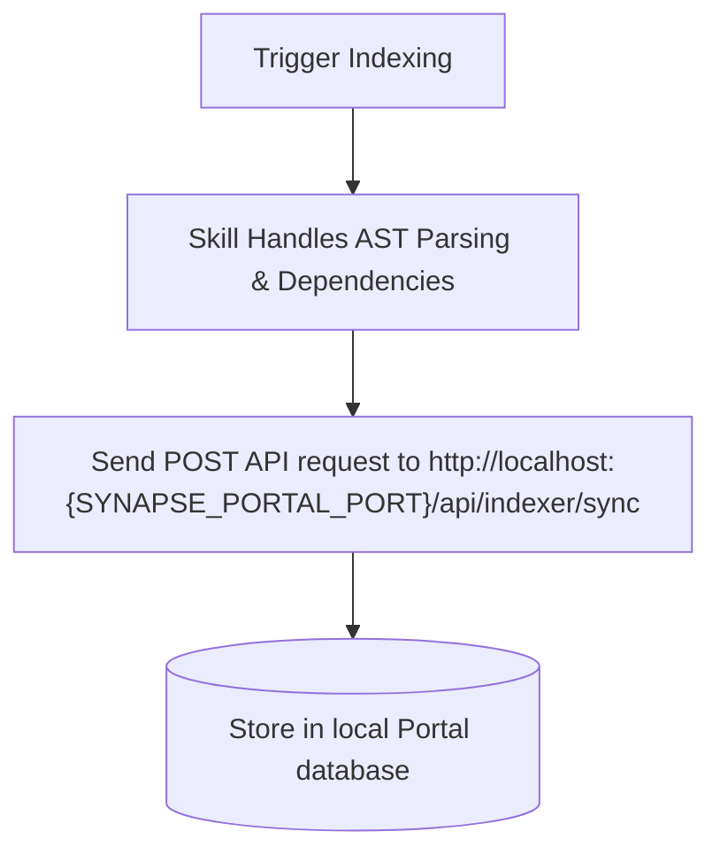

# 📖 Playbook: Codebase Scanning and Synchronization with Synapse Repo Indexer

This playbook guides developers and AI agents on how to trigger and execute the codebase scanning tool (indexer) to build an AST dependency graph and synchronize it to the local Synapse Portal database.

> [!CAUTION]
> **NO MANUAL DIRECTORY EXPLORATION**: When this playbook is active, you are strictly prohibited from using manual file-traversal tools (e.g. `list_dir`) to analyze the project directory structures. If the database graph is empty, you MUST first run the indexing sync script to build the AST index, and then query the dependency graph via the provided API endpoints.
>
> **MANDATORY PATH SPECIFICATION**: If you are indexing or analyzing an external project (such as `hip-store`), you MUST specify the target path with `--path /path/to/target`. Do NOT run the sync command without `--path` unless you explicitly want to index the current `synapse` workspace itself.
>
> **AI-FRIENDLY ENDPOINTS ALWAYS**: AI agents MUST always use the `/api/indexer/ai/...` endpoints instead of the standard `/api/indexer/...` endpoints to avoid context truncation and get structured path-based relations.

## 🎯 Trigger Conditions
- **When starting a new project (Brownfield):** Helps AI agents understand the entire repository structure right from the beginning.
- **After major refactoring:** When you rename, relocate, or restructure major folders, files, classes, or dependencies.
- **Before starting a new Sprint:** Ensures the agent's context and graph remain perfectly synced with the actual codebase.

## ⚙️ Workflows & Architecture

---

## 💻 Step-by-Step Execution

### ⏳ Skip Synchronization if Synced Within 1 Hour
Before running a synchronization, check the last sync time of the repository (e.g., via `GET /api/indexer/repos`). If the repository has been synced within the last 1 hour, **SKIP** the synchronization step. There is no need to re-sync.

### 1. Prerequisite Environment Check
Ensure the Synapse Portal is running locally on the port defined by the `{SYNAPSE_PORTAL_PORT}` environment variable (loaded dynamically via `env_loader.py`) to receive the sync payload.

### 2. Workflows (Sync & Query)
Refer directly to the [synapse-repo-indexer](../skills/synapse-repo-indexer/SKILL.md) skill for detailed workflows:
- **PORTAL SYNC Workflow:** To scan and sync codebase structures from the workspace terminal.
- **PORTAL QUERY Workflow:** To query the dependency graph (`GET /api/indexer/graph`) or reverse impact (`GET /api/indexer/impact`) programmatically.

### 🤖 AI-Friendly Query Endpoints
For AI agents executing code diagnostics and impact analysis, the following semantic endpoints should be preferred over raw database-ID based endpoints:
1. **Get Dependency Graph (Path-Based):**
   - `GET /api/indexer/ai/graph?repo=<repo_name>`
   - Returns a structured mapping of file paths to their defined symbols and list of relative file path dependencies (no raw UUIDs).
2. **Get File Details:**
   - `GET /api/indexer/ai/details?repo=<repo_name>&file=<relative_path>`
   - Returns detailed symbols, direct dependencies (imported paths), and direct dependents (importing paths).
3. **Get Semantic Impact (Blast Radius):**
   - `GET /api/indexer/ai/impact?repo=<repo_name>&file=<relative_path>`
   - Returns blast radius partitioned into `directlyAffected` (depth 1) and `indirectlyAffected` (depth > 1 with depth level).

Do not write or hardcode custom indexer commands or raw API client calls in project code files.

---

## 🔍 Verification
After the execution completes, verify the following:
1. **Console Output:** Ensure the logs show parser libraries installed successfully, files processed count, and a successful sync API response.
2. **API Status:** Check the Portal terminal logs to confirm a `POST /api/indexer/sync` request returned status `200 OK`.
